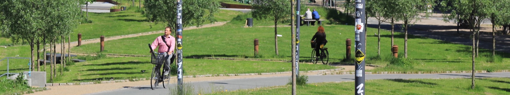

# Let's get people to bike!

People want to bike and do it safely! To make it happen, cities must provide well connected networks of protected bicycle infrastructure. Yet, politicians often lack the leadership to listen to their citizens, not building for cycling at all, or without a plan.

## 🛠️ The toolkit to design and improve bike networks
`BikeNetKit` is our answer to this problem. Currently under development, this digital toolkit will compile state-of-the-art bicycle network planning algorithms that we developed at [NERDS](https://nerds.itu.dk/) since 2019, packaged as a Python software suite - all made with local cycling know-how in Copenhagen. The software will be open-source, free and easy to use.

## 🧑‍💻 User-friendly software for planners and advocates
`BikeNetKit` is aimed at urban planners as a decision support tool for various network planning tasks, or for proactive citizens to create a compelling vision for urban cycling in their city. Close the gaps in your city's bike network, connect its components, or build one from scratch! 

## 🤝 Contributing to the ecosystem
We started developing `BikeNetKit` in 2026. Its components use a copyleft license, ensuring it will always stay free and reproducible. Development support by the community is very welcome! 👉 [How to contribute](../CONTRIBUTING.md)

## 🚧 Development status
To fulfil our 2026 grant deliverables, the below tools will be at least in "minimum viable product" form and packaged by 2026-12-31. By then we will also have an interactive visualization platform running at [bikenetkit.org](https://bikenetkit.org/). We intend to develop and maintain `BikeNetKit` beyond 2026.

| Tool | Code | Last release |
| ---------- | -------- | ------ | 
| [superblockify](https://github.com/BikeNetKit/superblockify) | Done | 1.0.2 | 
| [GrowBikeNet](https://github.com/BikeNetKit/GrowBikeNet) | In development | 0.7.1 | 
| [FixBikeNet](https://github.com/BikeNetKit/FixBikeNet) | In development | 0.5.0 | 
| [LinkBikeNet](https://github.com/BikeNetKit/LinkBikeNet) | Backlog | n/a | 
| [BikeDNA](https://github.com/BikeNetKit/BikeDNA) | Backlog | n/a | 
| [LoopBikeNet](https://github.com/BikeNetKit/LoopBikeNet) | Backlog | n/a | 

## Credits
`BikeNetKit` is funded by the [Innovation Fund Denmark](https://innovationsfonden.dk/en) and the EU project [JUST STREETS](https://www.just-streets.eu).  
Photo attribution: [2013-06-03 10.41.10 by Bikecopenhagen.dk](https://www.flickr.com/photos/bikecopenhagendk/10360140446/), [CC BY-NC 2.0](https://creativecommons.org/licenses/by-nc/2.0/deed.en)
