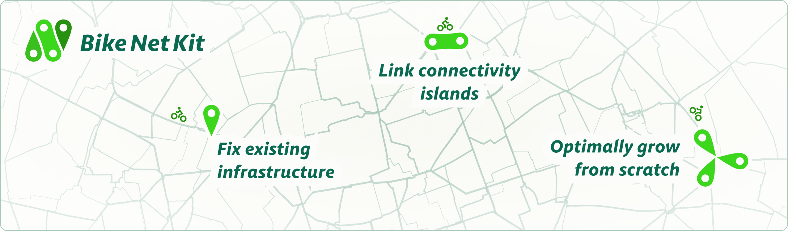

# Let's build bike networks that work!

People want to bike and do it safely. To make it happen, cities must provide well connected networks of protected bicycle infrastructure. Yet, politicians often lack the leadership to listen to their citizens, not building for cycling at all, or without a plan.

## 🛠️ The toolkit to design and improve bike networks
`BikeNetKit` is our answer to this problem. Currently under development, this digital toolkit compiles state-of-the-art bicycle network planning algorithms that we developed at [NERDS](https://nerds.itu.dk/) since 2019, packaged as a Python software suite - all made with local cycling know-how in Copenhagen. The software is open-source, free and easy to use.

## 🧑‍💻 User-friendly software for planners and advocates
`BikeNetKit` is aimed at urban planners as a decision support tool for various network planning tasks, or for proactive citizens to create a compelling vision for urban cycling in their city. Close the gaps in your city's bike network, connect its components, or build one from scratch! 

## 🤝 Contributing to the ecosystem
We started developing `BikeNetKit` in 2026. It uses a copyleft license, ensuring it will always stay free and reproducible. Development support by the community is very welcome! 👉 [How to contribute](../CONTRIBUTING.md)

## 🚧 Development status
To fulfil our 2026 grant deliverables, the below tools will be usable and packaged by 2026-12-31. By then we will also have an interactive visualization platform running at [bikenetkit.org](https://bikenetkit.org/). We will develop and maintain `BikeNetKit` beyond 2026.

| Tool | Status | Version |
| ---------- | -------- | :------: | 
| [superblockify](https://github.com/BikeNetKit/superblockify) | ✅ Stable | 1.0.2 | 
| [GrowBikeNet](https://github.com/BikeNetKit/GrowBikeNet) | 🚧 Beta | 0.11.1 | 
| [FixBikeNet](https://github.com/BikeNetKit/FixBikeNet) | 🚧 Alpha | 0.7.0 | 
| [LinkBikeNet](https://github.com/BikeNetKit/LinkBikeNet) | 🚧 Planning | n/a | 
| [LoopBikeNet](https://github.com/BikeNetKit/LoopBikeNet) | ⏳ Projected | n/a | 
| [BikeNetLib](https://github.com/BikeNetKit/BikeNetLib) | 🚧 Planning | 0.5.0 | 

## Supported by
Development of BikeNetKit is supported by the [Innovation Fund Denmark](https://innovationsfonden.dk/en), the EU HORIZON project [JUST STREETS](https://www.just-streets.eu), and the [Data Science Section](https://en.itu.dk/Research/Sections-and-research-groups/Data-Science) of IT University of Copenhagen.

 &emsp;&emsp;  &ensp;  

## Credits

### Software development
<table>
  <tr>
  <td valign="center"><a href="https://github.com/cbueth"></td><td valign="center"><a href="https://github.com/cbueth">Carlson M. Büth</a></td>
  <td valign="center"><a href="https://github.com/Manuel-Knepper"></td><td valign="center"><a href="https://github.com/Manuel-Knepper">Manuel Knepper</a></td>
  <td valign="center"><a href="https://github.com/marianamirandapessoa"></td><td valign="center"><a href="https://github.com/marianamirandapessoa">Mariana Pessoa</a></td>
  </tr>
  <tr>
  <td valign="center"><a href="https://github.com/mszell"></td><td valign="center"><a href="https://github.com/mszell">Michael Szell</a></td>
  <td valign="center"><a href="https://github.com/anastassiavybornova"></td><td valign="center"><a href="https://github.com/anastassiavybornova">Anastassia Vybornova</a></td>
  </tr>
</table>

### Design & Visualization
<table><tr><td valign="center"><a href="https://github.com/MoritzStefaner"></td><td valign="center"><a href="https://github.com/MoritzStefaner">Moritz Stefaner</a></td></tr></table>

### Lead
<table><tr><td valign="center"><a href="https://github.com/mszell"></td><td valign="center"><a href="https://github.com/mszell">Michael Szell</a></td></tr></table>

### Based on research by
Federico Battiston, Carlson M. Büth, Tiago Cunha, Ghourab Ghoshal, Astrid Gühnemann, Gerardo Iñiguez, Sayat Mimar, Luis G. Natera Orozco, Tyler Perlman, Roberta Sinatra, Michael Szell, Ane R. Vierø, Anastassia Vybornova
